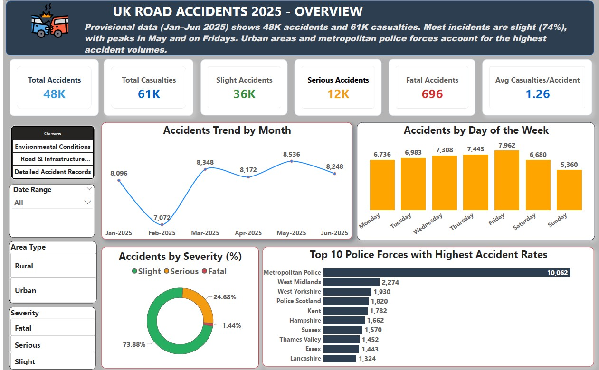
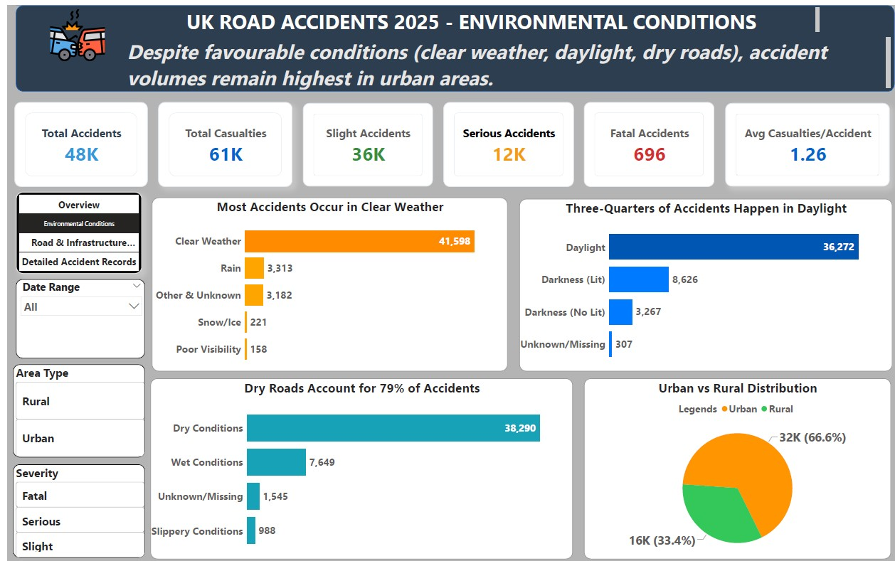
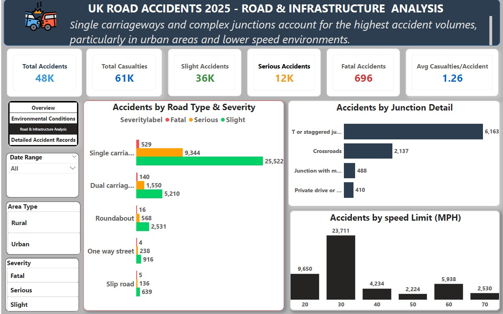
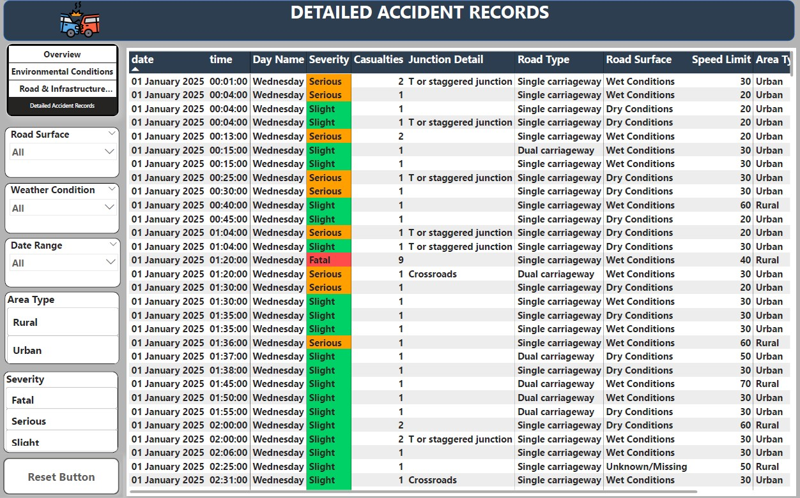

# UK-Road-Accidents-Analysis-2025
UK Road Accident Analysis  (Jan–Jun 2025) | Interactive Power BI Dashboard, highlighting trends, severity, environmental conditions, and road infrastructure risk factors.

## Project Overview
This project involved developing a comprehensive 4-page Power BI dashboard to analyze road accident data in the UK. The goal was to transform raw incident records into actionable insights regarding road safety, environmental factors, and infrastructure risks.

## 📂 Dataset & Scope

- **Source:** UK Road Accident Statistics (Provisional)
- **Coverage Period:** January – June 2025
- **Data Level:** Accident-level records
- **Geography:** United Kingdom
- **Status:** Provisional (subject to revision)

### Key Data Fields
- Accident date and time
- Accident severity and number of casualties
- Road type and junction detail
- Environmental conditions (weather, light, road surface)
- Area type (urban / rural)
- Police force
- Geographic coordinates (latitude & longitude)

- ## 📊 Dashboard Structure

The Power BI report is structured into **four focused pages**, each answering a specific business question and enabling clear, guided analysis.

### Page 1: Overview & Trends
**Purpose:** Provide a high-level summary of road accident trends and key metrics.

**Visuals:**
- KPI Cards: Total Accidents, Total Casualties, Fatal Accidents, Serious Accidents, Slight Accidents,Average Casualties per Accident
- Line Chart: Monthly accident trend
- Column Chart: Accidents by Day of Week
- Donut Chart: Accident severity distribution

**Key Question Answered:**
- When do accidents occur most, and how severe are they?

---

### Page 2: Severity & Environment Analysis
**Purpose:** Understand how environmental conditions influence accident severity.

**Visuals:**
- Pie Chart: Accidents by Area Type
- Bar Chart: Accidents by Weather Condition
- Bar Chart: Accidents by Light Condition
- Bar Chart: Accidents by Road Surface Condition

**Key Question Answered:**
- Under which conditions do severe accidents most frequently occur?

---

### Page 3: Road & Infrastructure Analysis
**Purpose:** Identify infrastructure and geographic risk patterns.

**Visuals:**
- Bar Chart: Accidents by Road Type and Severity
- Bar Chart: Accidents by Junction Detail
- Column Chart: Accident by Speed Limit(MPH)

**Key Question Answered:**
- Which road features and locations present higher accident risks?

---

### Page 4: Detailed Accident Records
**Purpose:** Enable detailed exploration and record-level analysis.

**Visuals:**
- Searchable table of accident records
- Cross-page filtering via slicers

**Key Question Answered:**
- What are the detailed characteristics of individual accidents?

## 🔍 Key Insights

- A total of **48K road accidents** were recorded between **January and June 2025**, resulting in **61K casualties**, highlighting a significant public safety challenge.

- **Slight accidents account for the majority (74%)**, while **serious accidents (25%)** form a substantial share, indicating a persistent risk of high-impact incidents despite low fatality rates.

- Accident volumes show a **clear monthly pattern**, with a noticeable dip in February and a **peak in May**, suggesting seasonal and behavioural influences on road safety.

- **Fridays record the highest number of accidents**, pointing to increased risk towards the end of the workweek, while weekends show comparatively lower incident levels.

- **Urban areas contribute the largest proportion of accidents**, reflecting higher traffic density and exposure compared to rural locations.

- Adverse **weather, poor light conditions, and wet road surfaces** are strongly associated with higher accident counts, increasing the likelihood of severe outcomes.

- Certain **road types and junction designs** consistently record higher accident volumes, indicating infrastructure-related risk factors.

- ## 💡 Business Recommendations

- **Target urban road safety interventions**  
  Given that the majority of accidents occur in urban areas, local authorities should prioritise traffic calming, improved signage, and pedestrian safety measures in high-density locations.

- **Focus on high-risk road infrastructure**  
  Single carriageways and complex junctions (T or staggered junctions, crossroads) consistently record the highest accident volumes. Infrastructure redesign, clearer lane markings, and junction visibility improvements should be prioritised.

- **Strengthen safety measures in lower speed zones (20–30 mph)**  
  Although speed limits are lower, these roads experience the highest number of accidents due to traffic density and frequent interactions. Enhanced enforcement, speed awareness campaigns, and road user education are recommended.

- **Maintain vigilance during favourable driving conditions**  
  Most accidents occur in clear weather, daylight, and dry road conditions, suggesting behavioural factors such as complacency. Public awareness campaigns should reinforce safe driving regardless of conditions.

- **Deploy time-based interventions**  
  With accident peaks observed on Fridays and during specific months, targeted enforcement and public messaging during high-risk periods could help reduce incident rates.

- **Use data-led monitoring for policy evaluation**  
  Continuous monitoring of provisional accident data will enable policymakers to assess the effectiveness of interventions and adapt strategies as more complete data becomes available.

## 🛠 Tools, Skills & Techniques Used

### Tools
- **Power BI Desktop** – Data modelling, DAX measures, interactive dashboards, and storytelling
- **Power Query** – Data cleaning, transformation, and handling coded variables
- **Microsoft Excel** – Initial data inspection and validation
- **GitHub** – Version control and project documentation

### Data Modelling
- **Star schema design** with a central collision fact table and multiple dimension tables
- Creation of **date and categorical dimensions** for time-based and contextual analysis
- Proper relationship management to support accurate filtering and slicing

### Analytics & Visualisation Techniques
- KPI development (Total Accidents, Casualties, Severity breakdown, Average Casualties per Accident)
- Time-series analysis (monthly accident trends)
- Categorical analysis (severity, road type, junction detail, weather, light, and road surface)
- Comparative analysis (urban vs rural, weekday patterns, speed limit distribution)
- Use of slicers for dynamic filtering and user-driven exploration

### Business & Analytical Skills Demonstrated
- Translating raw transport data into **actionable insights**
- Applying **data storytelling** principles across multiple dashboard pages
- Communicating findings using **clear business language**
- Designing dashboards for **policy, operational, and decision-making audiences**

  ## 📁 Project Structure

The repository is organised to ensure clarity, reproducibility, and ease of navigation:

### Files Included
- **Power BI (.pbix) file** containing all data models, measures, and dashboards
- **Dashboard screenshots** for quick viewing without opening Power BI
- **Provisional raw data** used for the analysis
- **README documentation** explaining the project, insights, and recommendations
- *Figure 1:

## 🖥 Dashboard Preview

- **Accident Overview**
  

 *Figure 1: Accident Overview*

- **Environmental Conditions**
  

  *Figure 2: Environmental Conditions*
 
- **Road & Infrastructure Analysis**

  *Figure 3: Road & Infrastructure Conditions*
 
- **Detailed Accident Records**
  

  *Figure 4: Detailed Accident Records*

